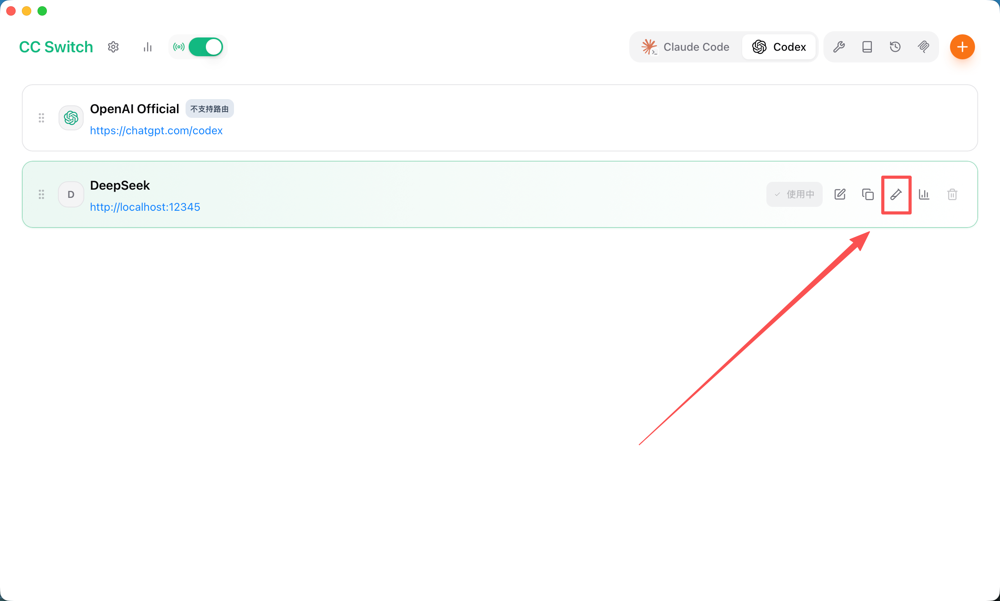

# Codex2DeepSeek

OpenAI Responses API ↔ DeepSeek Chat API 流式转发代理。

将 OpenAI Codex 等客户端发出的 Responses API 请求，实时转换为 DeepSeek Chat Completions 格式，实现 SSE 流式透传。

本项目配合 `CC Switch`使用，可实现 Codex IDE/CLI 与 DeepSeek Chat 的对接中转。

> 妈的，使用Codex，想用DeepSeek接入，找了半天工具，就没发现什么非常好用的工具，协议都不匹配，找到 [Nigel211/codex_deepseek_proxy](https://github.com/Nigel211/codex_deepseek_proxy.git) 但是单文件模式不习惯，使用flask框架也不喜欢，同时在使用中发现模型的对应问题，很头大，没工夫去慢慢研究了，所以重构了fastAPI的版本，后续有空的话会增加其他各路国产模型的适配。


## 特性

- **协议转换** — 将 OpenAI Responses API 请求（`input`/`instructions`/`tools` 等字段）自动映射为 DeepSeek Chat Completions 格式
- **流式透传** — 基于 SSE (Server-Sent Events) 实时转发 DeepSeek 响应，完整保留 `reasoning_content`（思考链）
- **工具调用** — 支持 Function Calling 的双向格式转换与消息重排，兼容并行工具调用
- **模型映射** — 通过环境变量灵活配置客户端模型名到 DeepSeek 模型的对应关系
- **身份验证** — 支持 Authorization Bearer Token 鉴权
- **轻量部署** — 仅依赖 FastAPI + Uvicorn + Requests

## 流程

```
Codex IDE/CLI          Proxy Server            DeepSeek API
─────────────          ─────────────           ────────────
Responses API ────→   格式转换 (Responses→Chat) ────→  /v1/chat/completions
SSE Stream    ←────   格式转换 (Chat→Responses)  ←────  SSE Stream
```

### 项目结构

```
├── main.py                     # 应用入口：CLI 参数、FastAPI 初始化、启动
├── pyproject.toml              # 项目配置与依赖声明
├── .env                        # 环境变量（API Key、模型映射等）
├── app/
│   ├── __init__.py
│   └── config.py               # 配置管理：.env 加载、API Key 交互式输入、模型映射表
├── routers/
│   ├── __init__.py             # 路由统一注册
│   ├── proxy.py                # API 端点：/responses, /v1/responses, /v1/chat/completions
│   ├── lifespan.py             # 应用生命周期管理
│   └── middleware.py           # 中间件：CORS、Auth 鉴权、模型名称解析
└── services/
    ├── __init__.py
    ├── converter.py            # 协议转换：Responses API → Chat Completions
    └── stream.py               # SSE 流式生成器
```

## 快速启动

> 前置条件：Python 3.8+、uv（uv 未安装请自行百度uv安装）

### 1. 安装依赖

```bash
git clone https://github.com/PineKings/Code2DeepSeek.git
cd Code2DeepSeek
uv sync
```

### 2. 配置

创建 `.env` 文件：

```ini
# DeepSeek API Key（必填）
DEEPSEEK_API_KEY=sk-your-deepseek-key

# 本服务鉴权密钥（必填，客户端请求需携带）
MY_API_KEY=sk-your-proxy-key

# 默认模型（请求中未指定模型时使用）
MODEL_DEFAULT=deepseek-v4-flash

# 模型映射：客户端模型名 → DeepSeek 模型名（留空则使用 MODEL_DEFAULT）
MODEL_GTP5_5=deepseek-v4-pro
MODEL_GTP5_4=deepseek-v4-flash
MODEl_GPT5_4_MINI=deepseek-v4-flash
MODEL_GTP5_3_CODEX=deepseek-v4-flash
MODEL_GTP5_2=deepseek-v4-flash
```

首次启动时若未配置 `DEEPSEEK_API_KEY` 或 `MY_API_KEY`，程序会交互式提示输入并自动写入 `.env`，该方式docker启动不可用❌。

### 3. 运行

```bash
uv run main.py
```

| 参数 | 默认值 | 说明 |
|------|--------|------|
| `--port` | `12345` | 服务端口 |
| `--host` | `0.0.0.0` | 绑定地址 |
| `--debug` | — | 启用调试日志 |


### 4. Docker 方式构建后部署

确保已安装 Docker 和 Docker Compose（Docker Desktop 已内置 compose）。

#### 构建镜像

```bash
# 从 Dockerfile 构建（根目录）
docker build -t codex2deepseek:latest .

# 跨平台构建
docker buildx build --platform linux/amd64,linux/arm64 -t codex2deepseek:latest .
```

#### 启动服务

```bash
# 使用 docker-compose.yml 后台启动
docker compose -f docker/docker-compose.yml up -d

# 查看日志
docker compose -f docker/docker-compose.yml logs -f

# 重启
docker compose -f docker/docker-compose.yml restart

# 停止并删除容器
docker compose -f docker/docker-compose.yml down
```

服务将在 `http://127.0.0.1:12345` 监听。

> ⚠️ `.env` 文件**必须**在启动前已配置好 `DEEPSEEK_API_KEY` 和 `MY_API_KEY`。Docker 模式下不支持交互式输入，请确认 `.env` 文件内容完整。

#### 单独使用 Docker（不依赖 Compose）

```bash
# 构建
docker build -t codex2deepseek:latest .

# 运行
docker run -d -p 127.0.0.1:12345:12345 \
  --name codex2deepseek \
  --env-file .env \
  --restart unless-stopped \
  codex2deepseek:latest
```

#### 文件说明

```
├── Dockerfile                     # 多阶段构建，builder 使用 python:3.12-slim + uv
├── docker/
│   ├── docker-compose.yml         # Compose 编排文件（构建 + 启动）
│   └── .env.example               # 环境变量模板
```

- `Dockerfile` 位于项目根目录，使用 python:3.12-slim 作为构建和运行时基镜像，避免 musl/glibc 不兼容问题
- `docker/docker-compose.yml` 位于 `docker/` 目录下，通过 `context: ..` 引用项目根目录的 `Dockerfile` 和 `.env`

### 5. Docker 部署
#### 拉取镜像
```bash
docker pull infoepochai/codex2deepseek:latest
```

#### 创建.env文件
```bash
touch .env
```

#### 编辑.env文件(`vi .env`)
```bash
# ==== codex_proxy 配置文件 ====
# 复制此文件为 .env 并填入你的配置

# 必填：DeepSeek API Key（从 https://platform.deepseek.com/api_keys 获取）
DEEPSEEK_API_KEY=*********

# 本服务的API Key，用于代理请求
MY_API_KEY=sk-1234567890

# 默认模型
MODEL_DEFAULT = deepseek-v4-flash

## codex模型对应,为空则使用默认模型
MODEL_GTP5_5 = deepseek-v4-pro
MODEL_GTP5_4 = deepseek-v4-flash
MODEl_GPT5_4_MINI = deepseek-v4-flash
MODEL_GTP5_3_CODEX = deepseek-v4-flash
MODEL_GTP5_2 = deepseek-v4-flash

# 可选：DeepSeek API 地址（默认官方地址，一般无需修改）
# DEEPSEEK_URL=https://api.deepseek.com/v1/chat/completions

# 可选：调试日志，设为 1 开启
# DEEPSEEK_DEBUG=1
```

#### 运行容器
```bash
docker run -d \
  --name codex2deepseek \
  -p 12345:12345 \
  --env-file ./.env \
  infoepochai/codex2deepseek:latest
```

## 用法

### API Endpoints

本项目无法直接实现codex的对接，需要配合CCSwitch等工具实现对接。

打开ccswitch，点击添加新供应商，选择自定义，填写代理地址和端口即可。

```
供应商名称: DeepSeek
API Key: sk-your-proxy-key
API 请求地址:http://127.0.0.1:12345(本地跑这个服务就本地，远程就改成你的ip和端口号)
```

注意：
- 点击“获取模型列表”按钮，报错“未找到可用的模型列表端点，请检查 Base URL 或确认供应商是否开放该接口”非常正常！因为本项目就没有中转模型列表获取的接口！
- 测试是否对接成功，在供应商列表，然后点击“测试模型”，如果返回了类似这样`DeepSeek 运行正常 (4ms)`的信息就说明成功了




## 模型映射

通过环境变量为每个 Codex 模型名指定对应的 DeepSeek 模型：

| 环境变量 | 默认值 | 客户端请求 model |
|---------|--------|-----------------|
| `MODEL_DEFAULT` | `deepseek-v4-flash` | 未指定或未匹配时使用 |
| `MODEL_GTP5_5` | `MODEL_DEFAULT` | `gpt-5.5` |
| `MODEL_GTP5_4` | `MODEL_DEFAULT` | `gpt-5.4` |
| `MODEl_GPT5_4_MINI` | `MODEL_DEFAULT` | `gpt-5.4-mini` |
| `MODEL_GTP5_3_CODEX` | `MODEL_DEFAULT` | `gpt-5.3-codex` |
| `MODEL_GTP5_2` | `MODEL_DEFAULT` | `gpt-5.2` |

模型解析优先级：`中间件解析值 > 请求体中的 model > MODEL_DEFAULT > 代码默认值`

## 环境变量

| 变量 | 必填 | 默认值 | 说明 |
|------|------|--------|------|
| `DEEPSEEK_API_KEY` | 是 | — | DeepSeek API 密钥 |
| `MY_API_KEY` | 是 | — | 本服务鉴权密钥 |
| `DEEPSEEK_URL` | 否 | `https://api.deepseek.com/v1/chat/completions` | DeepSeek API 地址 |
| `DEFAULT_MODEL` | 否 | `deepseek-v4-flash` | 无模型指定时的默认模型（旧配置） |
| `MODEL_DEFAULT` | 否 | `deepseek-v4-flash` | 模型映射默认值 |
| `DEEPSEEK_DEBUG` | 否 | `0` | 设为 `1` 启用调试日志到 `proxy_debug.log` |
| `MODEL_GTP5_5` | 否 | `MODEL_DEFAULT` | `gpt-5.5` 映射目标 |
| `MODEL_GTP5_4` | 否 | `MODEL_DEFAULT` | `gpt-5.4` 映射目标 |
| `MODEl_GPT5_4_MINI` | 否 | `MODEL_DEFAULT` | `gpt-5.4-mini` 映射目标 |
| `MODEL_GTP5_3_CODEX` | 否 | `MODEL_DEFAULT` | `gpt-5.3-codex` 映射目标 |
| `MODEL_GTP5_2` | 否 | `MODEL_DEFAULT` | `gpt-5.2` 映射目标 |

## Tool Calling 兼容性

代理处理了 DeepSeek Chat Completions API 与 OpenAI Responses API 之间的以下差异：

| 问题 | 处理方式 |
|------|----------|
| 工具定义格式不同 | 将 Responses API 扁平格式转为 Chat API 嵌套 `function` 格式，清除 `strict` 和 `additionalProperties` 字段 |
| 并行工具调用 | 将 Codex 的多个连续 `function_call` 项合并为单个 assistant 消息（含多个 `tool_calls`） |
| 消息顺序 | DeepSeek 要求 tool 消息紧跟对应的 assistant 消息；代理自动重排插入的 system 消息 |
| 思考模式 | 默认禁用（`thinking: {type: "disabled"}`），避免 `reasoning_content` 回传兼容问题 |
| `reasoning_content` | 仅在流结束事件中随 `item.done` 回传，避免破坏 Responses API 事件结构 |


## 归属权

本项目重构自 [Nigel211/codex_deepseek_proxy](https://github.com/Nigel211/codex_deepseek_proxy.git)，该项目以MIT协议开源，本项目亦同。
